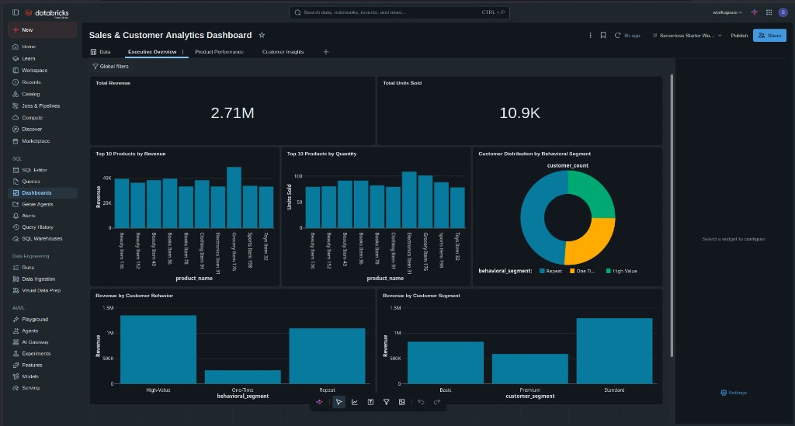
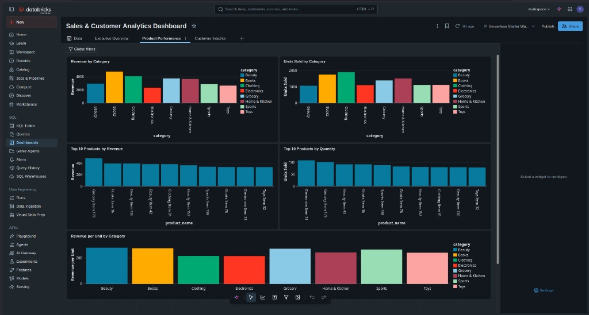
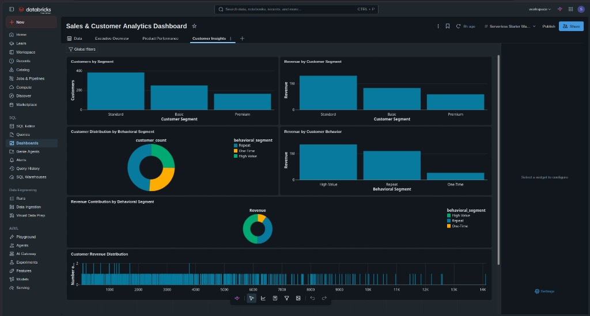

# Dashboard Guide — Phase 6

Consumption layer for **Gold** analytical tables on Databricks. Dashboard SQL does not read Bronze, Silver, raw CSV files, quarantine tables, or DQ summary tables.

---

## 1. Overview

```text
Bronze  →  Silver  →  Gold  →  Dashboard SQL  →  Databricks SQL visualizations
```

| Layer | Role |
|-------|------|
| Bronze | Raw ingest |
| Silver | Cleansed, validated entities and order lines |
| Gold | Pre-computed aggregates and dimensions for analytics |
| **Dashboard** | Visualization-ready `SELECT` queries over Gold only |

Business logic (revenue, order counts, segments, weekly boundaries) is defined in Gold. Dashboard queries **consume** those metrics; they do not redefine them or join back to lower layers.

**Artifacts:**

| File | Purpose |
|------|---------|
| `src/dashboard/dashboard_queries.sql` | Query catalog (15 queries: dashboard tiles + supplemental + validation) |
| `src/dashboard/DASHBOARD_GUIDE.md` | This guide |
| `src/dashboard/screenshots/` | Databricks SQL dashboard screenshots (3 pages) |

---

## 2. Prerequisites

- Databricks workspace with access to catalog `de_c1_coding_evaluation`
- **Gold schema** populated (`de_c1_coding_evaluation.gold.*`)
- Gold pipeline run successfully (`src/gold/create_gold_tables.py` on Serverless or equivalent)
- Databricks SQL (SQL editor or SQL warehouse) for ad hoc execution and visualizations

---

## 3. Gold dependencies

Dashboard reads **only** these four Gold tables:

| FQN | Grain | Key columns |
|-----|-------|-------------|
| `de_c1_coding_evaluation.gold.gold_sales_by_product` | One row per product with ≥1 order | `product_id`, `product_name`, `category`, `total_quantity`, `total_revenue` |
| `de_c1_coding_evaluation.gold.gold_revenue_by_customer` | One row per customer with ≥1 order | `customer_id`, `total_revenue` |
| `de_c1_coding_evaluation.gold.gold_daily_weekly_trends` | One row per (`time_grain`, `period_start`) | `time_grain` (`'day'` \| `'week'`), `period_start`, `total_revenue`, `order_count` |
| `de_c1_coding_evaluation.gold.gold_customer_segmentation` | One row per customer with ≥1 order | `customer_id`, `customer_segment`, `lifetime_value`, `frequency`, `total_spend` |

**Trend semantics:** Weekly rows use `time_grain = 'week'` with `period_start` = Monday of the calendar week (Spark `date_trunc('week')`). Do not recompute week boundaries in Dashboard SQL.

**Global totals:** Use entity Gold tables or KPI queries — do **not** sum daily and weekly trend rows together (double-counting).

**Column scope:** `order_count` exists only on `gold_daily_weekly_trends`. `gold_sales_by_product` exposes `total_quantity` and `total_revenue` only.

**Two segmentation types (do not confuse):**

| Type | Source | Values |
|------|--------|--------|
| Master-data segment | `gold_customer_segmentation.customer_segment` | `Premium`, `Standard`, `Basic` |
| Behavioral segment | Derived in Dashboard SQL from `frequency` + `total_spend` | `High-Value`, `Repeat`, `One-Time`, `Inactive`* |

\* `Inactive` (zero-order customers) is not in `gold_customer_segmentation` by Gold grain design.

---

## 4. Recommended dashboard layout

| Row | Tiles | Query | Viz type |
|-----|-------|-------|----------|
| **1 — KPI cards** | Total Customers, Total Spend, Total Orders, Avg Spend, Avg Frequency, Avg LTV | `overall_customer_kpis` | KPI counters |
| **2 — Trends** | Weekly Order Trend (primary), Daily Order Trend (secondary) | `weekly_order_trend`, `daily_order_trend` | Line charts |
| **3 — Products** | Top 10 Products by Revenue | `top_products_by_revenue` | Horizontal bar chart |
| **4 — Customer analysis** | Revenue Distribution, Behavioral Segmentation | `customer_revenue_distribution`, `behavioral_segment_summary` | Histogram, pie/donut |
| **5 — Optional** | Premium/Standard/Basic spend share | `segment_spend_share` | Donut chart |

**Best optional tile:** `segment_spend_share` — complements behavioral segmentation with master-data segment mix without duplicating the required histogram.

---

## 5. Query catalog

All queries live in `dashboard_queries.sql`. Execute one block at a time.

### Section 1 — KPI cards

| Query | Source | Viz |
|-------|--------|-----|
| `overall_customer_kpis` | `gold_customer_segmentation` + `gold_daily_weekly_trends` | KPI cards |

### Section 2 — Order trends

| Query | Source | Viz |
|-------|--------|-----|
| `weekly_order_trend` | `gold_daily_weekly_trends` (`time_grain = 'week'`) | Line chart |
| `daily_order_trend` | `gold_daily_weekly_trends` (`time_grain = 'day'`) | Line chart |

### Section 3 — Top products

| Query | Source | Viz |
|-------|--------|-----|
| `top_products_by_revenue` | `gold_sales_by_product` | Horizontal bar chart (Y: `product_name`, X: `total_revenue`, LIMIT 10 DESC) |

### Section 4 — Customer revenue distribution

| Query | Source | Viz |
|-------|--------|-----|
| `customer_revenue_distribution` | `gold_revenue_by_customer` | Histogram (X: revenue bin, Y: `customer_count`) |

### Section 5 — Behavioral segmentation

| Query | Source | Viz |
|-------|--------|-----|
| `behavioral_segment_summary` | `gold_customer_segmentation` (derived) | Pie/donut (`behavioral_segment` vs `customer_count` or `total_spend`) |

**Behavioral rules (Dashboard-layer):** High-Value = `total_spend` ≥ 75th percentile; Repeat = `frequency` ≥ 2 (not High-Value); One-Time = `frequency` = 1 (not High-Value).

### Section 6 — Master-data segment analysis (Premium / Standard / Basic)

| Query | Source | Viz |
|-------|--------|-----|
| `segment_summary` | `gold_customer_segmentation` | Grouped bar chart |
| `segment_spend_share` | `gold_customer_segmentation` | Donut/pie chart |

### Supplemental (optional)

| Query | Viz |
|-------|-----|
| `top_products_by_quantity` | Bar chart |
| `revenue_by_category` | Bar/donut |
| `top_customers_by_revenue` | Bar chart |

### Section 7 — Validation (not tiles)

| Query | Purpose |
|-------|---------|
| `validation_daily_weekly_order_totals` | Daily vs weekly order/revenue totals |
| `validation_segment_spend_reconciliation` | Segment spend sum |
| `validation_segment_pct_sum` | Premium/Standard/Basic % ≈ 100 |
| `validation_revenue_by_customer_vs_segmentation` | Revenue vs spend alignment |

---

## 6. Running the SQL

1. Open **Databricks** → **SQL** (or a notebook with `%sql` on a SQL warehouse).
2. Confirm Gold tables exist:  
   `SHOW TABLES IN de_c1_coding_evaluation.gold;`
3. Open or paste contents of `src/dashboard/dashboard_queries.sql`.
4. Run **one query block** at a time (each block starts with `-- Query: <name>`).
5. From the result grid, use **Add visualization** (or equivalent) to bind columns to chart types listed above.
6. To build a **SQL Dashboard**: save each query as a query object, add visualizations, then assemble them on a dashboard page. Exact UI labels may vary by workspace version; use the query result + visualization workflow your workspace provides.

---

## 6. Recommended visualizations

| Theme | Query | Chart type |
|-------|-------|------------|
| Product | `top_products_by_revenue`, `top_products_by_quantity` | Bar chart (`product_name` vs metric) |
| Product | `revenue_by_category` | Bar or donut (`category` vs `total_revenue`) |
| Customer | `top_customers_by_revenue` | Bar chart |
| Customer | `customer_revenue_summary_kpis` | KPI counters |
| Trends | `daily_revenue_trend`, `weekly_revenue_trend` | Line chart (`period_start` on X) |
| Trends | `daily_order_trend`, `weekly_order_trend` | Line chart |
| Segmentation | `segment_summary` | Grouped bar (metrics by `customer_segment`) |
| Segmentation | `segment_spend_share` | Pie/donut or bar (`pct_of_total_spend`) |

---

## 7. Validation baselines

Use these **post–Silver RI alignment** values when sanity-checking Gold inputs (not pre-fix baselines).

| Metric | Value |
|--------|-------|
| Gold revenue (`SUM` entity tables / reconciliation) | **2,708,411.08** |
| Gold quantity (`gold_sales_by_product`) | **10,899** |
| Gold distinct orders (daily trends `SUM(order_count)` or segmentation frequency logic) | **2,052** |

| Gold table | Row count |
|------------|-----------|
| `gold_sales_by_product` | **164** |
| `gold_revenue_by_customer` | **792** |
| `gold_customer_segmentation` | **792** |
| `gold_daily_weekly_trends` | **950** (818 daily + 132 weekly) |

**Do not use** legacy pre–RI-fix totals (`2,830,321.54` revenue, `11,464` quantity, `3,832` orders) as current baselines.

---

## 8. Interpretation

| Visualization | What it shows |
|---------------|---------------|
| Top products | Highest-revenue or highest-volume products from Gold sales aggregate |
| Revenue by category | Share of product revenue across categories (sum of Gold product metrics) |
| Top customers | Customers with highest `total_revenue` from Gold |
| Customer KPIs | Distribution summary over all customers with orders |
| Daily/weekly trends | Revenue and distinct order counts over time at the grain stored in Gold |
| Segment summary | How many customers per segment and average spend, frequency, and lifetime value |
| Segment spend share | Percent of total `total_spend` attributed to each segment |

---

## 9. Limitations / assumptions

- **Gold-only:** No customer names or product attributes beyond what Gold exposes (`product_name`, `category` on sales-by-product only; revenue-by-customer is `customer_id` only).
- **No product-level `order_count`:** `gold_sales_by_product` does not include `order_count`. Product performance queries use `total_quantity` and `total_revenue` only. Order-count trends use `gold_daily_weekly_trends`.
- **Trend double-counting:** Daily and weekly trend tables are separate grains; never add their revenue or order totals for a global KPI.
- **Segment `lifetime_value`:** Sourced from Silver customer master; Dashboard does not validate or recompute it against `total_spend`.
- **Empty periods:** Trend tables include only periods with at least one order (Gold definition); charts may show gaps if rendered with a continuous date axis in the BI tool.
- **Databricks validation:** Serverless execution of all dashboard queries should be confirmed in the target workspace before marking Phase 6 fully validated.

---

## Databricks validation checklist (operator)

Run after Gold pipeline is current:

```sql
-- A. Source availability
SHOW TABLES IN de_c1_coding_evaluation.gold;

-- B. Row counts
SELECT 'gold_sales_by_product' AS t, COUNT(*) AS n FROM de_c1_coding_evaluation.gold.gold_sales_by_product
UNION ALL SELECT 'gold_revenue_by_customer', COUNT(*) FROM de_c1_coding_evaluation.gold.gold_revenue_by_customer
UNION ALL SELECT 'gold_customer_segmentation', COUNT(*) FROM de_c1_coding_evaluation.gold.gold_customer_segmentation
UNION ALL SELECT 'gold_daily_weekly_trends', COUNT(*) FROM de_c1_coding_evaluation.gold.gold_daily_weekly_trends;

SELECT time_grain, COUNT(*) FROM de_c1_coding_evaluation.gold.gold_daily_weekly_trends GROUP BY time_grain;

-- C. Baseline reconciliation
SELECT SUM(total_revenue) FROM de_c1_coding_evaluation.gold.gold_sales_by_product;
SELECT SUM(total_quantity) FROM de_c1_coding_evaluation.gold.gold_sales_by_product;
SELECT SUM(order_count) FROM de_c1_coding_evaluation.gold.gold_daily_weekly_trends WHERE time_grain = 'day';
```

Then execute each named query in `dashboard_queries.sql` **one block at a time** and confirm success.

---

## Per-query Gold column validation

| Query | Gold source | Columns referenced | Valid |
|-------|-------------|-------------------|-------|
| `top_products_by_revenue` | `gold_sales_by_product` | `product_id`, `product_name`, `category`, `total_quantity`, `total_revenue` | Yes |
| `top_products_by_quantity` | `gold_sales_by_product` | `product_id`, `product_name`, `category`, `total_quantity`, `total_revenue` | Yes |
| `revenue_by_category` | `gold_sales_by_product` | `category`, `total_quantity`, `total_revenue` | Yes |
| `top_customers_by_revenue` | `gold_revenue_by_customer` | `customer_id`, `total_revenue` | Yes |
| `customer_revenue_summary_kpis` | `gold_revenue_by_customer` | `total_revenue` | Yes |
| `daily_revenue_trend` | `gold_daily_weekly_trends` | `time_grain`, `period_start`, `total_revenue`, `order_count` | Yes |
| `weekly_revenue_trend` | `gold_daily_weekly_trends` | `time_grain`, `period_start`, `total_revenue`, `order_count` | Yes |
| `daily_order_trend` | `gold_daily_weekly_trends` | `time_grain`, `period_start`, `order_count` | Yes |
| `weekly_order_trend` | `gold_daily_weekly_trends` | `time_grain`, `period_start`, `order_count` | Yes |
| `segment_summary` | `gold_customer_segmentation` | `customer_segment`, `total_spend`, `frequency`, `lifetime_value` | Yes |
| `segment_spend_share` | `gold_customer_segmentation` | `customer_segment`, `total_spend` | Yes |

---

## Visual evidence (Databricks SQL dashboard)

Screenshots from the validated **Sales & Customer Analytics Dashboard** on Databricks Serverless (catalog `de_c1_coding_evaluation`, Gold-only queries). KPIs align with documented baselines: total revenue **~2.71M** (2,708,411.08), total quantity **~10.9K** (10,899).

### Executive Overview



### Product Performance



### Customer Insights


